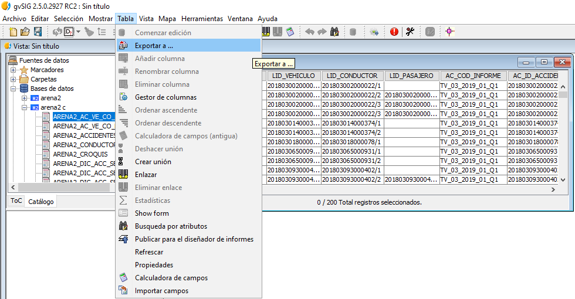
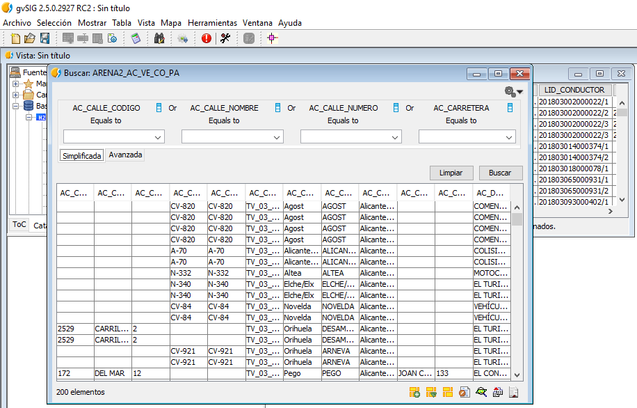

La ficha de búsqueda presenta la siguiente lista de características:

- Permite dar un orden especial a los datos, recomendados o más usados.
- Permite usar listas de valores para los campos en los que estén definidas. 
- Puede utilizarse  como soporte de búsqueda entre tablas. 
- Permite la exportación de los resultados obtenidos en diferentes formatos e informes.
- Permite la existencia de históricos y favoritos.
- Presenta 2 modos; Básica y Avanzada.
    
Para iniciar una consulta en la ficha de búsqueda sobre una tabla de la 
base de datos hay que tener dicha tabla abierta y pulsar en el Tabla y 
Búsqueda por atributos respectivamente. 

{ with=650 }

A continuación se muestra el diseño de la *Ficha de búsqueda*.

